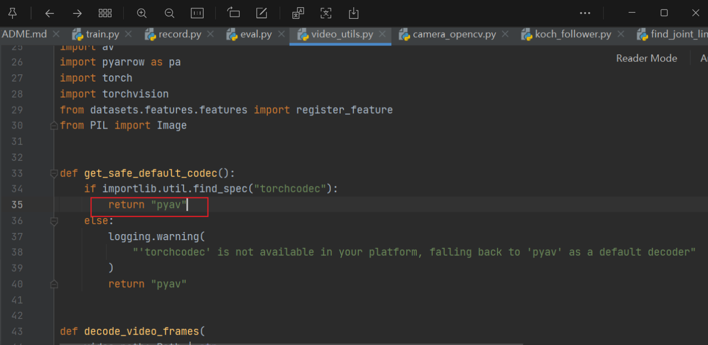
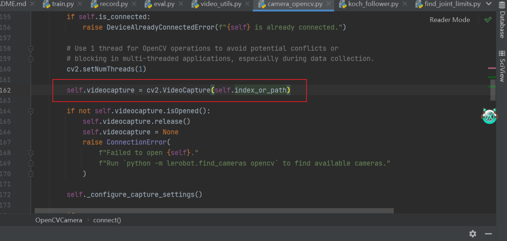
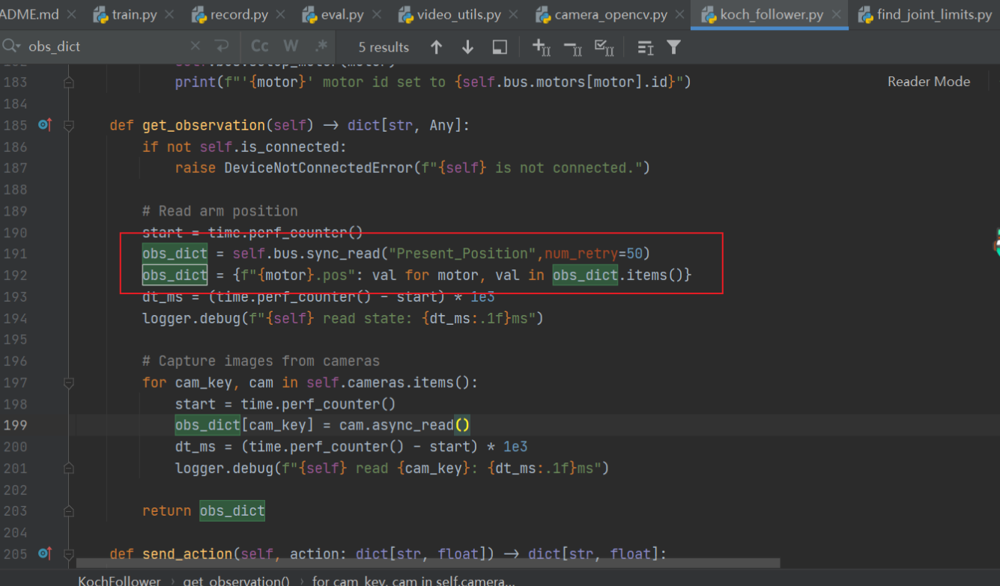

# Koch机器臂开发总结及其使用手册

## 源码微调

- 针对目前lerobot分支需要进行如下的修改：

1、 在video_utils.py文件内部需要修改torchcodec为pyav，因为这是视频编码格式问题，torchcodec容易导致不稳定，我们无论哪种方案都选择使用稳定的pyav



2、在camera_opencv.py将多余的部分删除，保留self.index_or_path



3、在执行数据集录制的过程中会出现因为双臂通信存在延迟问题，导致主、从臂连接不上从而引发录制数据集num_try次数达到上限，所以修改num_try次数避免数据集录制中断。具体步骤为修改koch_follower中部分代码问题



## 利用脚本使用lerobot框架内部的有关koch机器臂的相关代码

- Koch机器臂标定部分代码使用

使用的是calibrate部分的代码，选择好相对应的主从机器臂。

```python
标定：
python -m lerobot.calibrate --teleop.type=koch_leader --teleop.port=COM7 --teleop.id=my_leader

python -m lerobot.calibrate --robot.type=koch_follower --robot.port=COM4 --robot.id=my_follower
```

- 录制数据集相关代码

使用record部分的代码，注意几个问题：端口名称、robot_id与之前标定的时候保持一致，相机的index，录制周期数以及录制时间

```python
录制数据集：

python -m lerobot.record     --robot.type=koch_follower     --robot.port=COM4     --robot.id=my_follower     --robot.cameras="{ left: {type: opencv, index_or_path: 1, width: 640, height: 480, fps: 30, color_mode: 'rgb', rotation: 'NO_ROTATION'}, above: {type: opencv, index_or_path: 0, width: 640, height: 480, fps: 30, color_mode: 'rgb', rotation: 'NO_ROTATION'}}"     --teleop.type=koch_leader     --teleop.port=COM7     --teleop.id=my_leader     --display_data=true     --dataset.repo_id=renjielv030/training_datasets     --dataset.num_episodes=100     --dataset.episode_time_s=15     --dataset.reset_time_s=10     --dataset.single_task="Pick up the rectangular block and put it into the cup."     --dataset.push_to_hub=False    --dataset.root=D:\dataset_for_smolvla    --resume=false
```

- 训练代码

这是针对koch机器臂的训练，采取方法为VA模型的ACT算法以及其变种。注意output的目录，是在运行程序的当前目录，或者直接设置其固定路径。

```python
python -m lerobot.scripts.train   --policy.type=act   --policy.push_to_hub=false  --dataset.root=H:/dataset_for_smolvla
 --dataset.repo_id=lizhuohang/block_cup_dataset_ACT   --batch_size=16   --steps=20000   --output_dir=outputs/train/my_koch_lzh   --job_name=my_kochACT_training --policy.device=cuda   --wandb.enable=false --policy.device=cuda
```

- 评估、真机演示代码

这是针对koch机器臂选择指定策略，如act策略训练之后得到的模型权重来进行真机演示操作。


## 数据集相关定义部分

## ACT模型及其相关介绍

### pusht数据集

- meta数据集的内容

  1. episodes.jsons

     材料选取自record部分，包括录制数据集预训练以及

     ```json
     {"episode_index": 0, "tasks": ["Push the T-shaped block onto the T-shaped target."], "length": 161}
     {"episode_index": 1, "tasks": ["Push the T-shaped block onto the T-shaped target."], "length": 118}
     ```

     | 字段名        | 含义                                                         |
     | ------------- | ------------------------------------------------------------ |
     | episode_index | 当前记录这个周期的episode编号，这里记录的为第0个episode      |
     | tasks         | 任务描述，是一个自然语言指令，用于训练语言驱动的机器人控制（比如通过LLM理解任务） |
     | length        | 这个episode包含161帧/时间步，每一帧都有observation和action   |

  - `length` 表示某一个 episode（任务过程）中采集的**帧数/时间步数**。

    也就是机器人从开始执行这个任务，到结束，总共记录了多少个 `(observation, action)` 对，类似这样：

  - 这些数据是怎么采集来的？这些数据大多是通过如下 **3种方式之一**采集的：

    - **遥操作采集（Teleoperation）**

      人通过键盘/手柄/VR 控制真实或仿真的机械臂操作任务，并记录每一步的状态和动作。

    - 状态 = observation：如图像帧、关节位置等
    - 动作 = action：人输入的控制指令（如每个电机的移动量）

  - **自动策略采集（Policy Collection）**

    训练好的策略自己完成任务，每次运行时将整个过程录下来作为一个 episode。

  -  **仿真环境中脚本采集**
    - 写一个脚本或自动控制器，控制机器人在仿真环境中执行任务并记录下来。
    -  LeRobot/Pusht 看起来更偏向 **仿真数据 + 模仿学习采集**，数据也用于训练 Transformer 控制策略。

  2）`info.json`:

  - `info.json` 不包含实际的训练/演示数据
  - 它是对 **所有数据字段的结构、类型和含义** 的一个统一说明
  - 加载数据（如 `.parquet`）时会用到它，来正确解释每个字段

  3）`task.json`

  ```json
  {"task_index": 0, "task": "Push the T-shaped block onto the T-shaped target."}
  ```

  4）`episodes_stats.jsonl`

  - 这段 JSON 数据是对某个 episode（第 204 条）**统计信息（stats）**的总结分析，也就是对这一段交互过程里每个字段的整体分布做了一个数据描述。

- data数据

  - `episode_000000.parquet` `episode_000035.parquet` 

  | 列名                  | 含义                                                         |
  | --------------------- | ------------------------------------------------------------ |
  | **observation.state** | 当前状态向量（例如：电机的位置/角度）。这里是 `[x, y]` 形式，可能是某个物体在图像中的坐标位置。 |
  | **action**            | 机器人执行的动作。通常是控制信号，比如移动目标的偏移量或电机角度变更 |
  | **episode_index**     | 当前数据属于第几个 episode（第几段轨迹）                     |
  | **frame_index**       | 当前是该 episode 中的第几帧（从 0 开始）                     |
  | **timestamp**         | 时间戳，单位为秒，表示该帧相对于 episode 起始的时间          |
  | **next.reward**       | 当前动作执行后，**下一帧（next）**获得的奖励值               |
  | **next.done**         | 下一帧是否是 episode 的结束帧                                |
  | **next.success**      | 下一帧是否任务成功完成                                       |
  | **index**             | 当前样本在整个数据集中的索引编号（全局唯一）                 |
  | **task_index**        | 当前帧对应的任务编号（任务说明见 `tasks.jsonl`）             |
  
- videos数据集

  - `episode_000000.mp4` `episode_000030.mp4` 


3. LeRobot 项目定义的 **`LeRobotDataset` 数据集格式的官方说明**，这个格式是为了在强化学习（RL）与机器人学习任务中，统一处理视觉、动作、状态等信息而设计的。

- `hf_dataset`：这是**主数据表**（基于 Hugging Face datasets 库）： 每条数据代表一个**时刻帧**，字段举例如下：

  | 字段名                        | 含义                               | 类型                   |
  | ----------------------------- | ---------------------------------- | ---------------------- |
  | `observation.images.cam_high` | 图像帧（mp4 视频中的某帧）         | VideoFrame（带时间戳） |
  | `observation.state`           | 当前机器人状态（如关节角度、位置） | list[float32]          |
  | `action`                      | 期望控制目标（如目标关节位置）     | list[float32]          |
  | `timestamp`                   | 当前帧在该 episode 中的时间        | float32                |
  | `episode_index`               | 当前帧属于哪个 episode             | int64                  |
  | `frame_index`                 | 在该 episode 中的帧编号，从 0 开始 | int64                  |
  | `next.done`                   | 这一帧是否是 episode 的最后一帧    | bool                   |
  | `index`                       | 在整个数据集中的全局索引           | int64                  |

## ACT原理算法流程介绍

（⚠️**注：以下描述的各数据维度不一定对，代码整理来自claud3.7**）

1. ACT作为斯坦福最新的Mobile ALOHA系统的最核心的算法：Action Chunking with Transformer。它为啥效果这么好，其实主要的就是Transformer生成式算法，在ACT中主要使用的是CVAE。

2. 首先要清楚AE、VAE、CVAE的概念，B站有甚很多教程

3. 数据集目录结构分析

   - `episodes` 目录：存储每个交互片段的PyTorch文件
   - `meta_data` 目录：包含索引和统计信息
   - `train` 目录：Arrow格式的训练数据
   - `videos` 目录：录制的视频文件

4. 相机标定方式**相机与机器人的空间关系**：

   - ACT算法不需要显式的相机标定，因为它是一个端到端的方法

   - 系统通过示范数据学习相机视角与机器人动作之间的映射关系

   - 在训练数据中，模型隐式学习了相机视角中的物体位置与所需机器人动作之间的关系

   - ACT通过以下方式实现这一点：

     通过示范数据学习视觉-运动映射：示范数据包含相机图像和对应的机器人关节角度

     模型学习了将视觉观察直接映射到关节空间动作的能力

     这避免了显式的坐标系转换和逆运动学计算

5. 总结来说，ACT算法的核心优势在于它不需要显式的相机标定或坐标系转换，而是通过端到端学习直接从原始感知数据到控制命令的映射，使机器人能够模仿人类示范的动作。

6. ACT (Action Chunking Transformer) 模型的完整数据处理流程如下：

- 1）输入数据预处理：

  ```python
  # 输入数据准备
  observation = robot.capture_observation()         # 包含相机图像和机器人状态
  normalized_data = normalize_inputs(observation)   # 数据归一化处理
  ```

  ```python
  {
      "observation": {
          "images": {
              "laptop": [T, H, W, 3], # T个时间步的图像序列
              "phone": [T, H, W, 3]
          },
          "state": [T, state_dim] # T个时间步的机器人状态
      },
      "action": [T, action_dim] # T个时间步的动作（舵机值）
  }
  ```

  - observation数据如下(rerun.io展示图的数据就是action、state、image，可以对照上面展示图看)：

    - 在时间步T，有`observation.images.laptop[t]`、`observation.images.phone[t]`、`observation.state[t]`和`action[t]`

    - `observation.state[t]`：时间步t时follower arm的实际位置
    - `action[t]`：时间步t时发送给follower arm的目标位置（来自leader arm）


  - 在训练过程中，这些数据被用来：

    训练输入：

    - 使用observation.images[t]（相机图像）
    - 使用observation.state[t]（机器人状态）

    训练目标：

    - 使用action[t]作为模型应该预测的目标


- 2）视觉特征提取

```python
# 多相机视觉特征提取
all_cam_features = []
all_cam_pos_embeds = []  # 同时保存位置编码

for camera_index in range(num_cameras):
    # 从输入图像提取特征
    image = normalized_data["observation.images"][:, camera_index]  # [B, 3, H, W]
    features = resnet_backbone(image)["feature_map"]                # [B, C, h, w]
    
    # 生成位置编码
    pos_embed = sinusoidal_position_embedding(features)             # [B, C, h, w]
    
    # 特征映射转换
    cam_features = conv1x1(features)                                # [B, D, h, w]
    
    # 分别保存特征和位置编码
    all_cam_features.append(cam_features)
    all_cam_pos_embeds.append(pos_embed)

# 拼接所有相机特征和位置编码
vision_features = concat(all_cam_features, dim=-1)                  # [B, D, h, combined_w]
vision_pos_embeds = concat(all_cam_pos_embeds, dim=-1)              # [B, D, h, combined_w]

# 转换为序列格式，即Transformer输入格式：[序列长度, 批量大小, 特征维度]
vision_tokens = reshape(vision_features, "b d h w -> (h w) b d")    # [(h*w), B, D]
vision_pos_embeds = reshape(vision_pos_embeds, "b d h w -> (h w) b d")  # [(h*w), B, D]

# 将视觉特征和其他特征一起添加到编码器输入
encoder_tokens.extend(vision_tokens)
encoder_pos_embeds.extend(vision_pos_embeds)  # 位置编码也一同加入

# 最终在Transformer编码器中使用
encoder_output = transformer_encoder(
    encoder_tokens,
    pos_embed=encoder_pos_embeds  # 这里传入位置编码
)
```

- 3）VAE仅处理动作序列

```python
# VAE编码器流程 (仅在训练时使用)
# 准备VAE编码器输入
cls_token = cls_embed_weight.repeat(batch_size, 1, 1)               # [B, 1, D]
state_token = linear_proj(observation["observation.state"])          # [B, 1, D]
action_tokens = linear_proj(observation["action"])                   # [B, seq_len, D]

# 将所有token拼接
vae_input = concat([cls_token, state_token, action_tokens], dim=1)  # [B, seq_len+2, D]
vae_input = add_positional_embedding(vae_input)                      # [B, seq_len+2, D]
vae_input = vae_input.permute(1, 0, 2)                               # [seq_len+2, B, D]

# VAE编码器前向传播
encoder_output = vae_encoder(vae_input)                              # [seq_len+2, B, D]
cls_output = encoder_output[0]                                       # [B, D]

# 生成隐空间分布参数
latent_params = linear_proj(cls_output)                              # [B, 2*latent_dim]
mu = latent_params[:, :latent_dim]                                   # [B, latent_dim]
log_sigma_x2 = latent_params[:, latent_dim:]                         # [B, latent_dim]

# 采样潜变量
z = mu + exp(log_sigma_x2/2) * random_normal(mu.shape)               # [B, latent_dim]
```

- 分离的编码和解码路径：

  VAE编码器：state + action → 潜变量z

  Transformer阶段：z + state + images → 预测action

- 4）Transformer编码器

```python
# 准备编码器输入
encoder_tokens = []

# 添加潜变量token
latent_token = linear_proj(z)                                        # [B, D]
encoder_tokens.append(latent_token)                                  # [1, B, D]

# 添加状态token
if use_robot_state:
    state_token = linear_proj(observation["observation.state"])      # [B, D]
    encoder_tokens.append(state_token)                               # [1+1, B, D]

# 添加环境状态token (如果有)，本次采集不包括环境状态
if use_env_state:
    env_token = linear_proj(observation["observation.environment_state"])  # [B, D]
    encoder_tokens.append(env_token)                                 # [1, B, D]

# 将视觉特征添加到encoder tokens
encoder_tokens.extend(vision_tokens)                                 # [1+1+h*w, B, D]

# 添加位置编码
pos_embed = prepare_position_embeddings(encoder_tokens)              # [1+1+h*w, B, D]

# Transformer编码器前向传播
encoder_output = transformer_encoder(encoder_tokens, pos_embed)      # [1+1+h*w, B, D]
```

- 添加环境状态token，环境状态是指：

  环境中的非机器人状态信息

  通常是环境中物体的位置、朝向、物理属性等

  可能来自外部传感器或模拟环境

- 这个功能主要在以下场景中使用：

  模拟环境：

  - 例如MuJoCo、Isaac Sim等物理模拟器

  - 模拟器可以精确提供所有物体的位置和朝向

  有外部跟踪系统的实验室：

  - 使用运动捕捉系统（如OptiTrack、Vicon）

  - 这些系统可以精确跟踪环境中的物体

  多模态训练：

  - 有时研究人员想比较"有环境状态"和"无环境状态"的性能差异

  - 这需要模型架构支持可选的环境状态输入

- 5）Transformer解码器

```python
# 准备解码器输入，相当于transformer解码器的query
decoder_tokens = zeros(chunk_size, batch_size, dim_model)            # [chunk_size, B, D]
decoder_pos_embed = decoder_positional_embedding.weight              # [chunk_size, D]
decoder_pos_embed = decoder_pos_embed.unsqueeze(1).repeat(1, batch_size, 1)  # [chunk_size, B, D]

# Transformer解码器前向传播
memory = encoder_output                                              # [1+1+h*w, B, D]
decoder_output = transformer_decoder(
    decoder_tokens,                                                  # [chunk_size, B, D]
    memory,                                                          # [1+1+h*w, B, D]
    tgt_pos=decoder_pos_embed,                                       # [chunk_size, B, D]
    memory_pos=pos_embed                                             # [1+1+h*w, B, D]
)                                                                    # [chunk_size, B, D]
```

- 6）动作预测头

```python
# 预测动作序列
decoder_output = decoder_output.transpose(0, 1)                      # [B, chunk_size, D]
predicted_actions = action_head(decoder_output)                      # [B, chunk_size, action_dim]

# 反归一化输出
actions = unnormalize_outputs(predicted_actions)                     # [B, chunk_size, action_dim]
```

- 7）训练损失计算

```python
# 在训练过程中计算损失
# 计算重建损失
l1_loss = masked_l1_loss(predicted_actions, target_actions)          # 忽略padding部分

# 如果使用VAE，计算KL散度损失
if use_vae:
    kl_loss = -0.5 * sum(1 + log_sigma_x2 - mu^2 - exp(log_sigma_x2))
    total_loss = l1_loss + kl_weight * kl_loss
else:
    total_loss = l1_loss
```

- 8）推理时候的动作选择

```python
# 没有使用时间集成的代码，我目前的推理是没有使用时间集成的
@torch.no_grad
def select_action(observation):
    # 标准化输入
    normalized_obs = normalize_inputs(observation)
    
    # 如果队列为空，运行模型生成新的动作序列
    if action_queue.empty():
        # 前向传播生成动作序列
        actions = forward_pass(normalized_obs)                       # [B, chunk_size, action_dim]
        actions = unnormalize_outputs(actions)                       # [B, chunk_size, action_dim]
        
        # 将预测的动作序列加入队列（只取第一个批次样本）
        for i in range(n_action_steps):  # 注意这里是n_action_steps
            action_queue.append(actions[0, i])  # 注意这里只取第一个样本[0,i]
    
    # 返回下一个动作
    return action_queue.popleft()
```

9）chunk的理解，以及时间集成的概念

- Chunk指的是模型一次预测的连续动作序列。ACT模型不是每次只预测一个时间步的动作，而是预测一个"块"（chunk）的动作，这个块包含多个连续时间步的动作序列，解码器的维度decoder_tokens：[chunk_size, B, D]。

- Chunk在训练和推理中的应用

  训练阶段：

  - 模型学习预测长度为chunk_size的动作序列

  - 例如：如果chunk_size=100，模型会同时预测100个时间步的动作

  推理阶段：

  - 模型一次生成chunk_size长度的动作序列

  - 这些动作被存入队列，然后逐步执行

  - 当队列为空时，再次调用模型生成新的动作序列

- 关于z的来源和作用

  - z的来源：z是从VAE编码器生成的潜变量

    架构图中的z确实是VAE编码器输出的

    代码中使用重参数化技巧采样：z = mu + exp(log_sigma_x2/2) * random_normal(mu.shape)

  - z的作用：

    增加模型的随机多样性和泛化能力

    编码动作序列的隐含结构，而不仅是单个状态到单个动作的映射

  - 将动作分布从确定性转为概率分布

    如果z=0：模型会退化为确定性映射

    失去泛化到新情况的能力

  - 调整KL权重：在配置中修改kl_weight（默认为10.0）

    增大这个值会强制z分布更接近标准正态分布

    减小这个值会允许z保留更多任务特定信息

- 时间集成最准确的描述应该是：

  时间集成的本质是对"同一个实际时刻"的动作进行多次预测并集成，

  如果我们将实际执行的时刻标记为[T₀, T₁, T₂, ...]：

  - 在时刻t=0，我们预测了[T₀, T₁, T₂, ...T₉₉]的动作

  - 在时刻t=1 (执行完T₀后)，我们预测了[T₁, T₂, T₃, ...T₁₀₀]的动作

  - 在时刻t=2 (执行完T₁后)，我们预测了[T₂, T₃, T₄, ...T₁₀₁]的动作

  论文中图中错位的格子就是在表示：

  - 对实际时刻T₂的预测在t=0时是第3个位置

  - 对实际时刻T₂的预测在t=1时是第2个位置

  - 对实际时刻T₂的预测在t=2时是第1个位置

  集成公式应该理解为：对实际时刻T_k的最终动作是多次预测的加权平均

- 目前推理没有使用时间集成，如果要使用需要修改如下配置：

  ```yaml
     # 编辑配置文件，这是训练后生成的配置文件，推理的时候会自动加载
     vi outputs/train/koch_clip_clay_bowl/checkpoints/last/pretrained_model/config.yaml
     
     # 找到并修改这两行
     temporal_ensemble_momentum: null  # 改为 temporal_ensemble_coeff: 0.01
     n_action_steps: 100               # 改为 n_action_steps: 1
  ```

10）架构总结：

- 输入流：

  相机图像 → 归一化 → ResNet骨干网络 → 视觉特征

  机器人状态 → 归一化 → 线性投影 → 状态特征

- VAE编码器 (训练时):

  [CLS] + 状态 + 动作序列 → Transformer编码器 → 隐空间分布 → 采样潜变量z

- Transformer编码器:

  潜变量 + 状态 + 视觉特征 → 多层自注意力 → 上下文编码

- Transformer解码器:

  位置查询 + 编码器记忆 → 交叉注意力 → 动作序列表示

- 输出流:

  解码器输出 → 线性层 → 动作预测 → 反归一化 → 机器人动作

